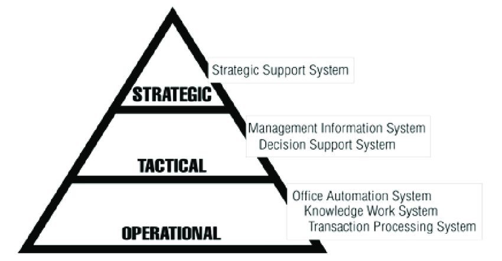

Tools: Stages of BI projects

Load => Store => Model => Visualization

1. Could be: 
- Load: Extract, Load and Transform
- Store: ETL to data-warehouse (could be a dimensional database)
- Model: Design your cubes, such spoon + pentaho workbench.
- Visualization: powerbi, superset, tableau, looker, Mode, pentaho saiku

2. 
- Load: airflow, google transfer-service, cloud storages (data-lakes)
- Store: E-L-t to datawarehouse (not necessary dimesional model)
- Model: dbt or dataform (ELT)
- Visualization: same as (1)

_______________________

ETL vs ELT (data modelling)

- Extract => Transform => load to datawarehouse
- Extract => Load to Data Warehouse => Transform data once it is in a DW

ELT is faster an more flexible, has lower cost and maintenance but ETL is more stable and compliant.

If we have restrictions of storage and compute costs, ELT and Data modelling solutions are a better choices.

____________________________________

Kimball: 

Objective
- deliver fast queries to be use by several depending on organization levels (operational, tactical and strategic)

Approach: 
    Dimensional model
    Des-normalization (3NF)

    XXXXX
        Fact-tables (verbs) business process [ measures, metrics, facts ]
        Dimensional-Tables (nouns) business entities

    Architecture:
        Stage Area: raw data
        Processing Area:  from raw to information [DIKW pyramid](https://en.wikipedia.org/wiki/DIKW_pyramid)
        Presentation Area: visualization to stakeholders

Kimball
- denormalized: star schema
- query fast and simple for reporting
- bottom-up: datamarts => data-warehouse. From Business process to organization departments
- incremental build
- single-source of truth is not real, because some data could be not integrated due to its nature.
- difficult to add more dimensions to existing/current data

Disadvantage: 
- pass the data to the denormalized data: etl is time-consuming!
- duplicated data and also between data marts
- needs always support and development.

References: 
- https://www.geeksforgeeks.org/difference-between-kimball-and-inmon/
- https://www.astera.com/type/blog/data-warehouse-concepts/
- https://datawarehouse.es/index.html

Alternatives: Inmon
- top-down approach: from organization departments to business process
- isolated data-marts (disadvantage)
- real single-source of truth
References: 
- https://www.youtube.com/watch?v=Tff34jj_V-0
- https://www.geeksforgeeks.org/difference-between-kimball-and-inmon/

Alternatives: Data Vault
- Alternative data model for datawarehousing
- address weeknesses of the other designs (snowflake and star)
- Arq => sources > data lake > staging > raw vault > reporting
- Hubs, keys, links, satellite tables, reference tables
- ETL process: 
  - load hubs with surrogated keys
  - create links
  - create satelites

- datamarts are built on top of data-vaults as presentation layer
    - links and satellites => facts
    - hubs and satellites => dimensions

- enhances: 
    - incremental build with multiples sources
    - tracking data lineage
    - easy to mantain etl

- book: https://www.amazon.com/-/es/Daniel-Linstedt/dp/0128025107
References: 
- https://www.youtube.com/watch?v=D914nNWGP6E
________________________________________

DBT: data build tool

- is the T of ELT
- raw data in data warehouse

Workflow: develop => test and document => deployment (VCS and CI/CD)
NOTE: test and document is difficult to afford with plain-sql.

How DBT works
- Cloud => on big query
- Postgres => local

Materialization strategies:
- table
- view
- incremental
- ephemeral